# Deep Generative Models Course - Homework Solutions

## Introduction

This repository contains my solutions to six Deep Generative Models assignments, each exploring a different topic in generative models and neural networks. The notebooks feature implementations of key models such as CLIP, LSTMs, VAEs, GANs, Flow-Based Models, DDPMs, and EBMs. These solutions focus on real-world datasets, including MNIST, CelebA, and a custom captcha dataset, showcasing a variety of deep learning techniques.

## Table of Contents

1. [Homework 1: OpenAI CLIP Model (Food 101)](#homework-1)
2. [Homework 2: Autoregressive Generative Models and Variational Autoencoders](#homework-2)
   - [Part 1: Autoregressive Generative Models (Yahoo Finance)](#part-1-autoregressive-generative-models-lstm)
   - [Part 2: Variational Autoencoders (MNIST)](#part-2-variational-autoencoders-mnist)
3. [Homework 3: GANs and Flow-Based Models](#homework-3)
   - [Part 1: Generative Adversarial Networks (MNIST & CIFAR10)](#part-1-generative-adversarial-networks-gans)
   - [Part 2: Flow-Based Models (CelebA)](#part-2-flow-based-models-celeba)
4. [Homework 4: Denoising Diffusion and Energy-Based Models](#homework-4)
   - [Part 1: Denoising Diffusion Probabilistic Models (Captcha Dataset)](#part-1-denoising-diffusion-probabilistic-models-captcha-dataset)
   - [Part 2: Energy-Based Models (MNIST)](#part-2-energy-based-models-mnist)

---

### Homework 1: OpenAI CLIP Model

In this notebook, I evaluate the [OpenAI CLIP](https://openai.com/research/clip) model. The focus is on understanding how CLIP associates text and images in a shared embedding space.

  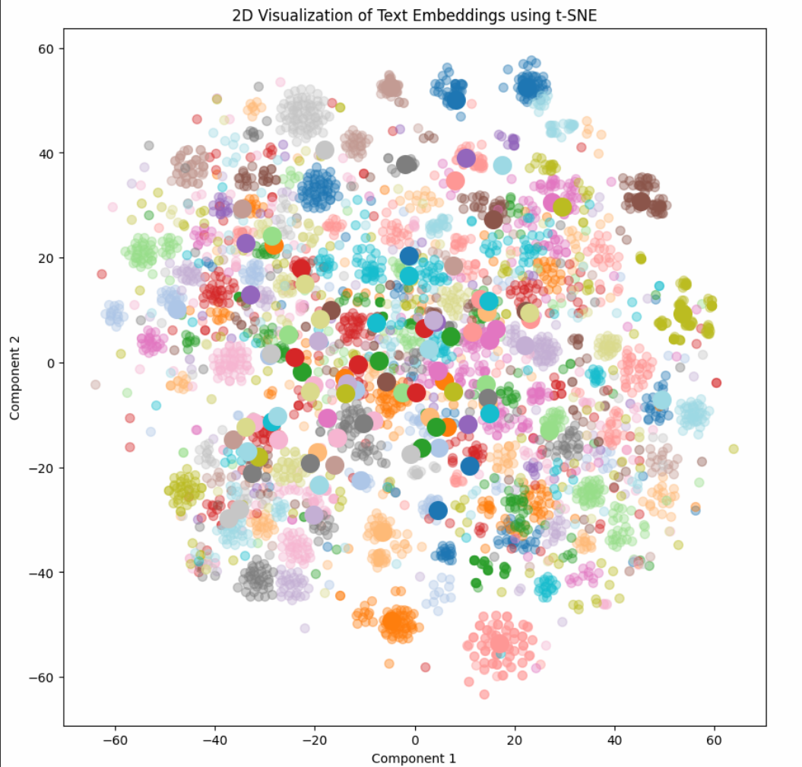

  <em>Visualization of embeddings for fine-grained labels (represented with smaller data points and an alpha value of 0.4) alongside the original labels (depicted with larger data points). Each class is assigned a distinct color for differentiation, and a legend is included for clarity.</em>

---

### Homework 2: Autoregressive Generative Models and Variational Autoencoders

#### [Part 1: Autoregressive Generative Models (LSTM)](#homework-2)

I implemented an LSTM-based autoregressive generative model to predict stock prices, using historical stock data. The model captures complex temporal dependencies by factorizing the joint probability of the time series using the chain rule of probability.

  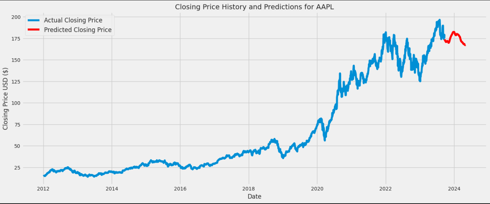

  <em>Time series visualization of stock market data, with actual prices shown in blue and predicted prices in red, highlighting the model's forecasting performance.</em>

 

  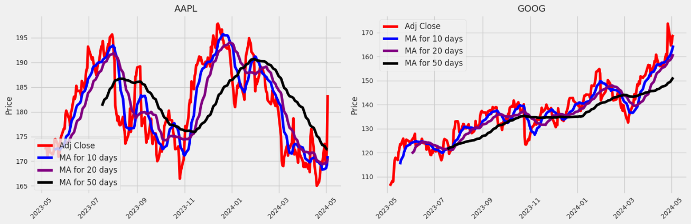

  <em>Stock price trends showing the 10, 20, and 50-day moving averages alongside adjusted closing prices, highlighting overall price trends.</em>

#### [Part 2: Variational Autoencoders (MNIST)](#homework-2)

In this part, I implemented a Variational Autoencoder (VAE) to generate new handwritten digits using the MNIST dataset. The VAE model learns a latent space representation and generates new digits by sampling from the learned distribution.

  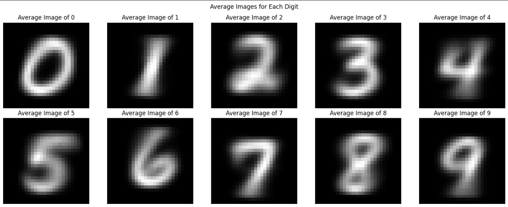

  <em>Average images for each digit (0-9) generated by the Variational Autoencoder, illustrating the typical features of handwritten digits.</em>

---

### Homework 3: GANs and Flow-Based Models

#### [Part 1: Generative Adversarial Networks (GANs)](#homework-3)

This section includes implementations of Conditional GANs and Wasserstein GANs. The goal was to improve stability during training while generating high-quality images through adversarial learning.

  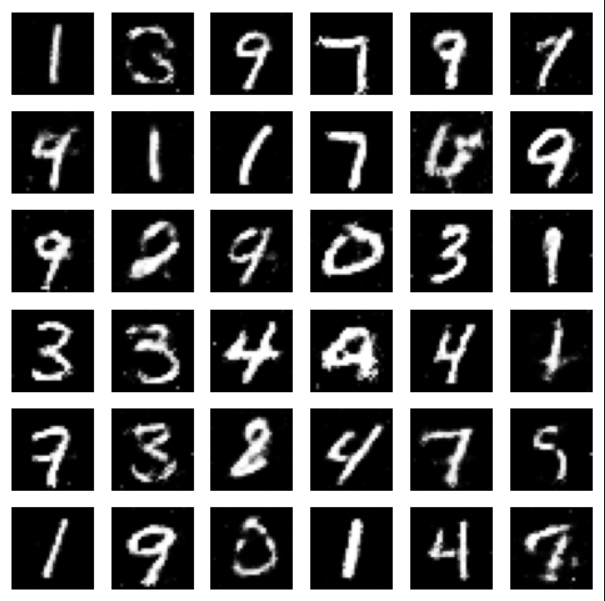

  <em>Generated images of handwritten digits (0-9) from the Basic GAN model trained on the MNIST dataset, demonstrating the model's ability to capture the diversity of digit styles.</em>

 

  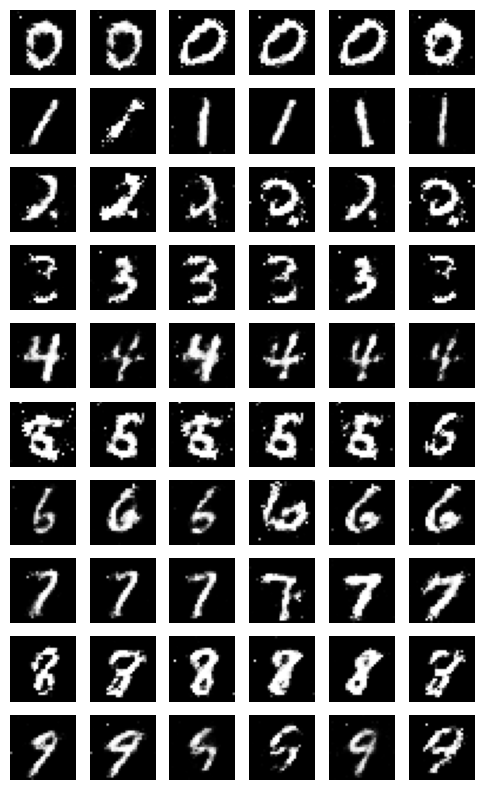

  <em>Conditional GAN-generated images of handwritten digits, showcasing the model's capability to produce digits based on specified labels from the MNIST dataset.</em>

 

  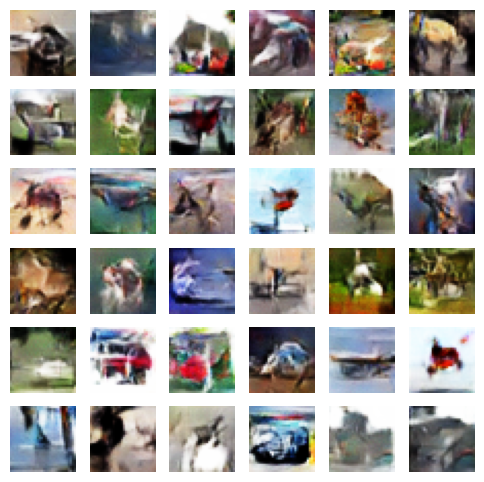

  <em>Generated images from the Wasserstein GAN model trained on the CIFAR-10 dataset, illustrating improved visual quality and diversity compared to traditional GANs.</em>

#### [Part 2: Flow-Based Models (CelebA)](#homework-3)

I applied normalizing flows to enhance a VAE for more realistic image generation on the CelebA dataset. Flow-based models enable efficient and exact sampling, which improves the expressiveness of the latent space representation.

  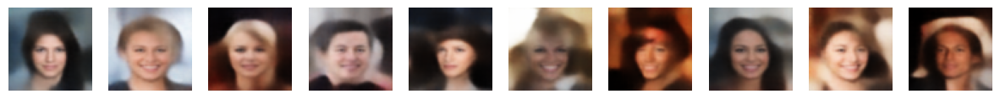

  <em>Generated images from the Normalizing Flow model.</em>

---

### Homework 4: Denoising Diffusion and Energy-Based Models

#### [Part 1: Denoising Diffusion Probabilistic Models (Captcha Dataset)](#homework-4)

I implemented a Denoising Diffusion Probabilistic Model (DDPM) to generate new captcha images by progressively adding noise and learning to reverse this process. The captcha dataset consists of RGB images with corresponding text labels.

  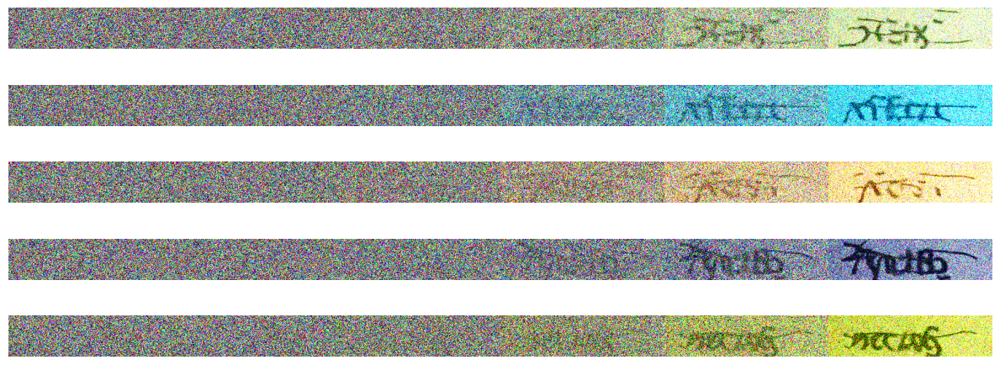

  <em>Generated captcha images from the Denoising Diffusion Probabilistic Model (DDPM) trained on the captcha dataset, showcasing the model's ability to create diverse and realistic samples without conditioning.</em>

 

  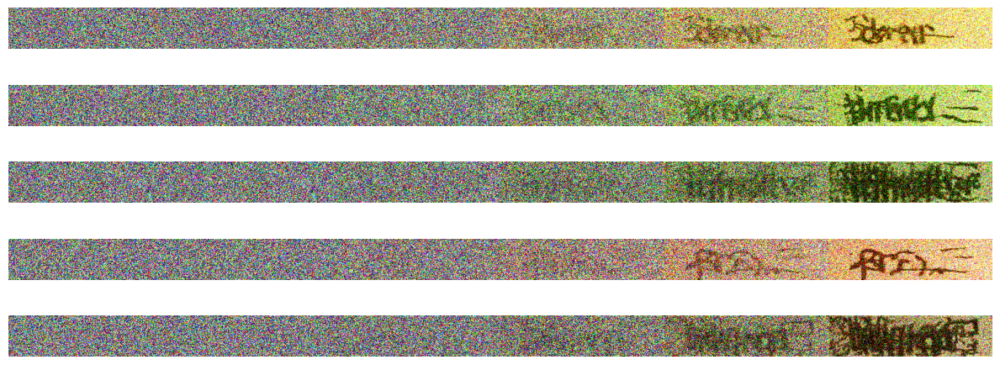

  <em>Conditional generated captcha images from the Denoising Diffusion Probabilistic Model (DDPM), illustrating the model's capability to produce targeted outputs based on specified text conditions.</em>

#### [Part 2: Energy-Based Models (MNIST)](#homework-4)

In this part, I implemented an Energy-Based Model (EBM) using contrastive divergence on the MNIST dataset. The model learns to generate new samples by optimizing energy functions based on training data.

  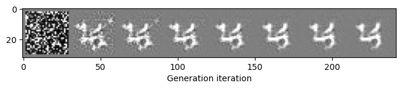

  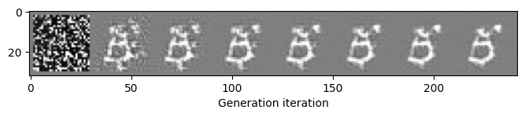

  <em>Generated digit samples from the Energy-Based Model (EBM) trained on the MNIST dataset using contrastive divergence, showcasing the model's ability to create new images.</em>

